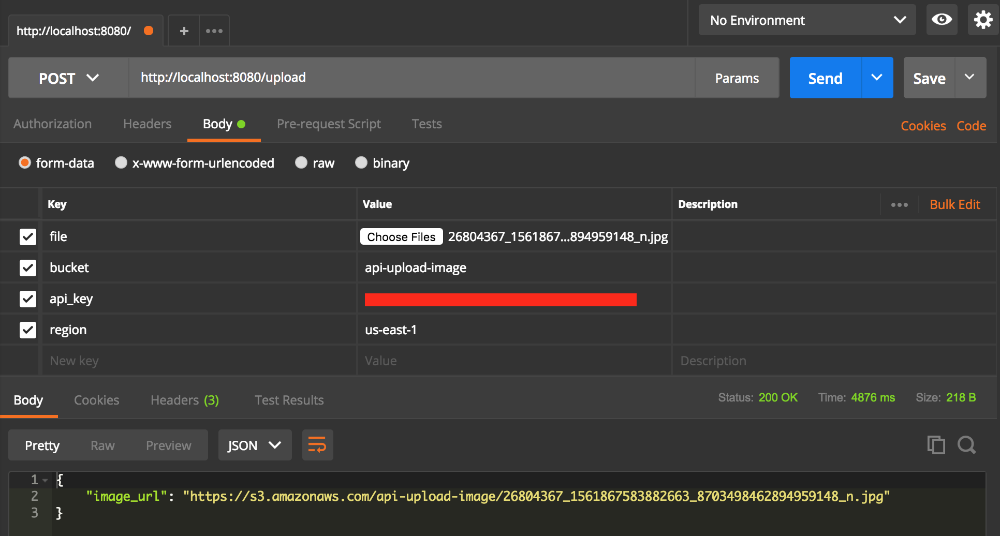

# Service Upload Image 

Upload file image to AWS S3 using aws-sdk-go

This document assumes that you have a working [Go development environment.](https://golang.org/doc/install)

# Usage
1. Clone project :joy:
2. Open terminal or cmd
3. Go to directory proojet and use command `go run main.go`
4. Test upload image by [Postman](https://www.getpostman.com/)

This project requires the five parameters specified to connect to Amazon S3.

| Parameter  | Description| 
| :---         |     :---     |
| file   | File for upload to AWS S3 (file type image only) | 
| bucket | Name directory for upload image |
| region | Name region your bucket upload file. ([see name region](https://docs.aws.amazon.com/general/latest/gr/rande.html))  |
| access_key | Access key is the user ID that uniquely identifies your account. |
| secret_key | Secret key is the password for your account. But this example get it from `env`. You can export path in `.bash_profile` or `.zshrc` which name `S3_SECRET_ACCESS_KEY`. You can also change your constant in code all right! |